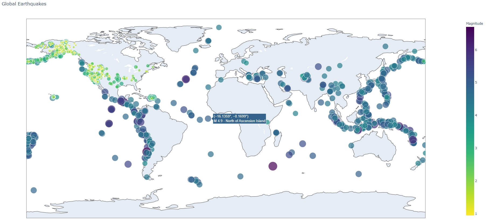

# Mapping_Earthquakes
## Overview
The point of this project is to take 30 days worth of global earthquake data and chart it on a map. We wanted to color code and scale the size of the data points to reflect the relative magnitude of the earthquakes.
## Results 

The map turned out beautifully, and correctly displays additional information when the user hovers over any of the data points.
